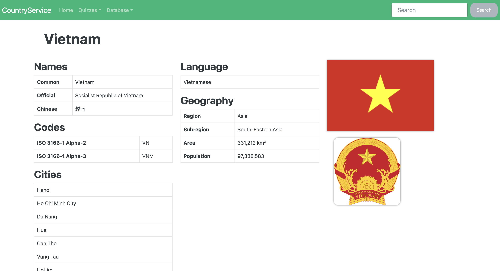
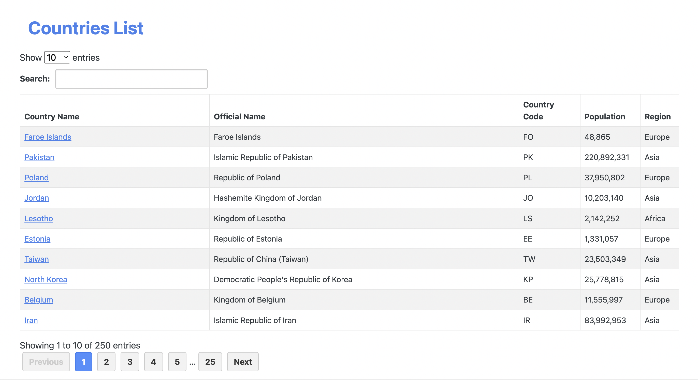
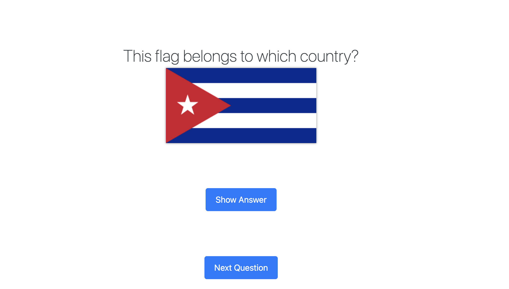
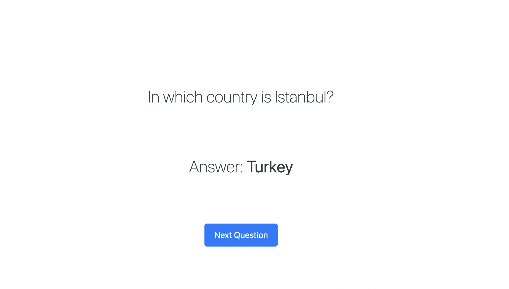
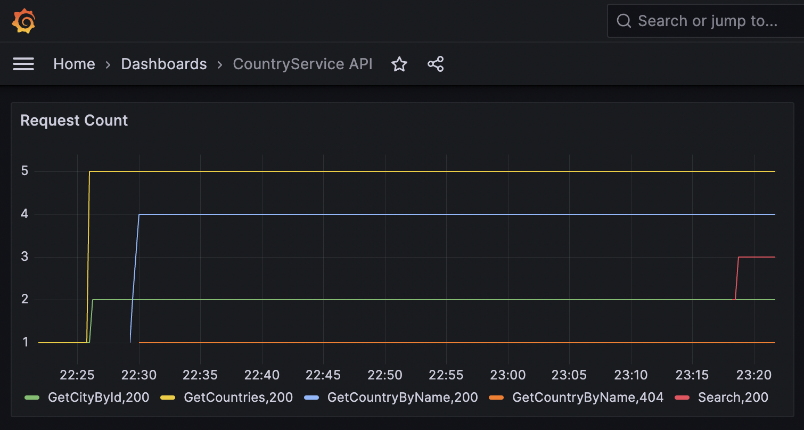

# Marco
Project using .NET 7 Web Application for storing data about Countries and Cities around the world. Provide educational quizzes. 
### Tech stack:
- .NET API/MVC
- SQL Server
- ElasticSearch
- Redis
- AWS S3
- Prometheus/Grafana

##### Country Detail

##### Countries Database

##### Quiz on Flags

##### Quiz on Cities

##### Grafana Dashboards
